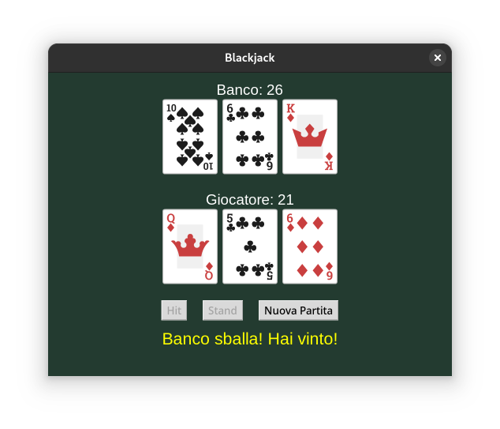

# 🎮 Blackjack Python Game


Un'elegante implementazione del gioco del Blackjack in Python con interfaccia grafica realizzata utilizzando Tkinter.

## ✨ Caratteristiche

- 🎯 Interfaccia grafica intuitiva
- 🃏 Grafica delle carte
- 🎮 Controlli semplici (Hit, Stand, Nuova Partita)
- 🎯 Regole standard del Blackjack da casinò
- 🔄 Il banco pesca fino a 17

## 🚀 Requisiti

- Python 3.x
- Pillow (PIL Fork)
- Tkinter (incluso con Python)

## 📦 Installazione

1. Clona il repository:
```bash
git clone https://github.com/yourusername/BlackJack_Python.git
cd BlackJack_Python
```

2. Crea un ambiente virtuale:

   **Windows**:
   ```bash
   python -m venv venv
   .\venv\Scripts\activate
   ```

   **macOS/Linux**:
   ```bash
   python3 -m venv venv
   source venv/bin/activate
   ```

   **Git Bash su Windows**:
   ```bash
   python -m venv venv
   source venv/Scripts/activate
   ```

3. Installa le dipendenze:
```bash
pip install Pillow
```

> **Nota**: Per disattivare l'ambiente virtuale quando hai finito, usa il comando `deactivate`

## 🎮 Come giocare

1. Avvia il gioco:
```bash
python main.py
```

2. Comandi di gioco:
   - **Hit**: Chiedi un'altra carta
   - **Stand**: Termina il tuo turno
   - **Nuova Partita**: Inizia una nuova partita

## 🎲 Regole del gioco

- 👉 L'obiettivo è battere il banco ottenendo un punteggio più alto senza superare 21
- 🎯 Le carte numeriche valgono il loro valore
- 👑 Le figure (J, Q, K) valgono 10
- 🎴 L'Asso vale 11 o 1
- 🎰 Il banco deve pescare su 16 e stare su 17

## 🖼️ Screenshot



## 🔧 Struttura del progetto

```
BlackJack_Python/
│
├── main.py           # File principale del gioco
├── assets/          # Risorse grafiche
│   └── r88_Casino/
│       └── img/
│           └── cards/  # Immagini delle carte
│
├── README.md        # Documentazione
└── LICENSE          # Licenza MIT
```

## 📝 License

Questo progetto è distribuito con licenza MIT. Vedi il file `LICENSE` per maggiori dettagli.

## 👥 Contributi

Contributi, segnalazioni di bug e nuove funzionalità sono sempre benvenuti! Sentiti libero di aprire una issue o inviare una pull request.